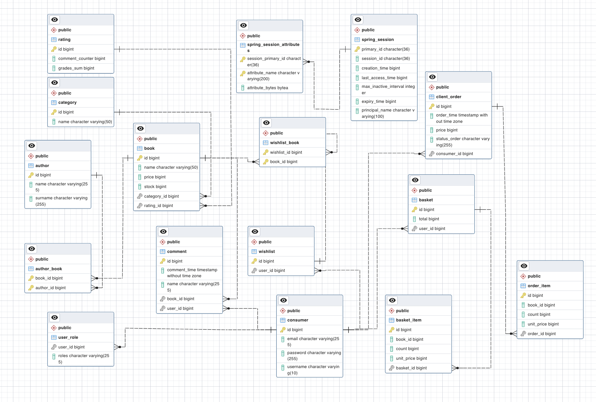

## About
This app is an online bookstore. 
Registered user can search, sort them in different fields, add to wish list, buy, leave reviews.
The administrator can add, delete and edit book titles, list of authors and categories.

### How to run the application?
The application requires a database to work:
PostgreSQL (URL: Online_book_store, username: postgres, password: admin).
Or change corresponding properties in application.properties.
The schema of the database will be generated automatically on startup, and destroyed on shutdown.
On startup the database will be initialized from data.sql file.

### Default users for testing
There are two default user roles:
ADMIN (login: admin, password: admin)
USER (login: user, password: user)

### Schema 

